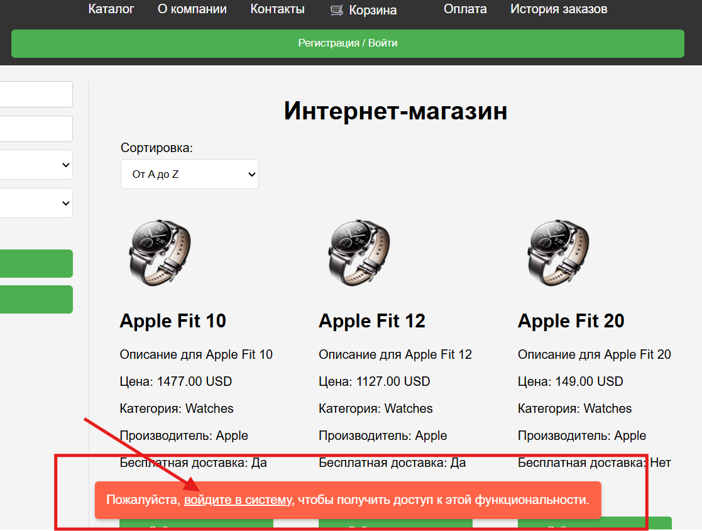
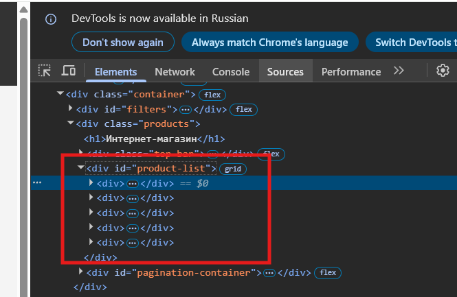
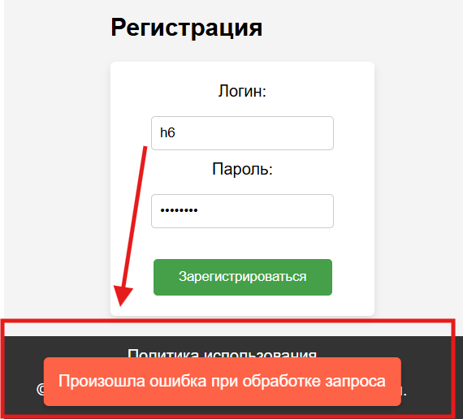
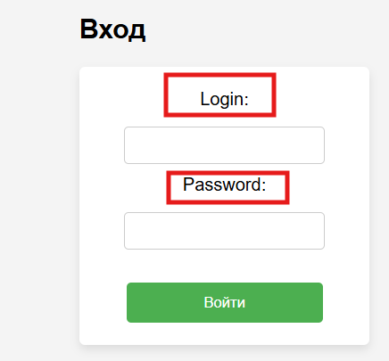
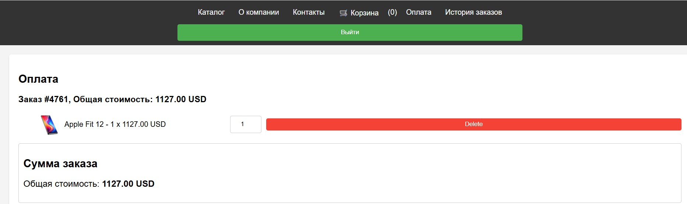
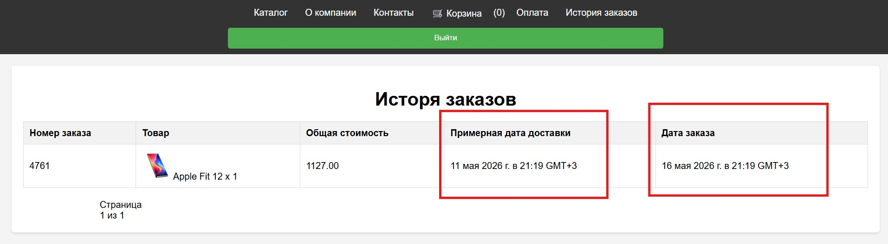

# Bug Reports

# Сортировка

🐞 БАГ 1 — Сортировка по цене при выборе «Цена по убыванию» отображает товары по возрастанию в каталоге товаров

## Описание

При выборе сортировки «Цена по убыванию» товары отображаются от самой низкой цены к самой высокой.

---

## Окружение

* ОС: Windows 11
* Браузер: Google Chrome 136

---

## Предусловия

Пользователь находится на главной странице каталога товаров.

---

## Шаги воспроизведения

1. Перейти на главную страницу каталога: https://intern.demoshopping.ru/
2. Открыть контрол сортировки.
3. Выбрать опцию «Цена по убыванию».
4. Просмотреть порядок отображения товаров в списке.

---

## Фактический результат

При выборе «Цена по убыванию» товары отображаются от самой низкой цены к самой высокой.

---

## Ожидаемый результат

Опция «Цена по убыванию» должна отображать товары от самой высокой цены к самой низкой.

---

## Severity

High

---

## Priority

High

---

🐞 БАГ 2 — Сортировка по цене при выборе «Цена по возрастанию» отображает товары по убыванию в каталоге товаров

## Описание

При выборе сортировки «Цена по возрастанию» товары отображаются от самой высокой цены к самой низкой.

---

## Окружение

* ОС: Windows 11
* Браузер: Google Chrome 136

---

## Предусловия

Пользователь находится на главной странице каталога товаров.

---

## Шаги воспроизведения

1. Перейти на главную страницу каталога: https://intern.demoshopping.ru/
2. Открыть контрол сортировки.
3. Выбрать опцию «Цена по возрастанию».
4. Просмотреть порядок отображения товаров в списке.

---

## Фактический результат

При выборе «Цена по возрастанию» товары отображаются от самой высокой цены к самой низкой.

---

## Ожидаемый результат

Опция «Цена по возрастанию» должна отображать товары от самой низкой цены к самой высокой.

---

## Severity

High

---

## Priority

High

---

# Каталог

🐞 БАГ 3 — Изображения товаров не загружаются при переходе на следующую страницу каталога

## Описание

При переходе на следующую страницу каталога часть изображений товаров не загружается.

---

## Окружение

* ОС: Windows 11
* Браузер: Google Chrome 136

---

## Предусловия

Пользователь находится на главной странице каталога товаров.

---

## Шаги воспроизведения

1. Перейти на главную страницу каталога: https://intern.demoshopping.ru/
2. Открыть DevTools.
3. Перейти во вкладку Network.
4. Перейти на страницу каталога 2.
5. Проверить загрузку изображений товаров.

---

## Фактический результат

Часть изображений товаров не загружается при переходе на следующую страницу каталога.

---

## Ожидаемый результат

Все изображения товаров должны корректно загружаться при переходе между страницами каталога.

---

## Severity

Medium

---

## Priority

Medium 
## Скриншот

---

🐞 БАГ 4 — На странице каталога отображается 5 товаров вместо 6

## Описание

Количество отображаемых товаров на странице каталога не соответствует макету Figma.

---

## Окружение

* ОС: Windows 11
* Браузер: Google Chrome 136

---

## Предусловия

Пользователь находится на главной странице каталога товаров.

---

## Шаги воспроизведения

1. Перейти на главную страницу каталога: https://intern.demoshopping.ru/
2. Открыть DevTools.
3. Перейти во вкладку Elements.
4. Найти `
`.
5. Развернуть структуру HTML внутри `
`.
6. Подсчитать количество элементов товаров.

---

## Фактический результат

Внутри `
` отображается 5 элементов, и на странице видно 5 карточек товара.

---

## Ожидаемый результат

Согласно макету Figma, должно отображаться 6 товаров на странице (3 в первом ряду и 3 во втором). Соответственно, внутри `
` должно быть 6 элементов.

---

## Severity

High

---

## Priority

High
## Скриншот

---

# Оплата

🐞 БАГ 5 — Оплата проходит успешно при выборе неверного типа карты на странице оплаты

## Описание

Система позволяет успешно оформить оплату при выборе типа карты Visa и вводе данных карты MasterCard.

---

## Окружение

* ОС: Windows 11
* Браузер: Google Chrome 136

---

## Предусловия

В корзине присутствует хотя бы один товар.

---

## Шаги воспроизведения

1. Открыть страницу: https://intern.demoshopping.ru/
2. Добавить любой товар в корзину.
3. Перейти в корзину.
4. Нажать «Оформить заказ».
5. На шаге выбора типа карты выбрать VISA.
6. Ввести данные карты MasterCard, имя, фамилию и email.
7. Нажать «Оформить заказ».

---

## Фактический результат

Оплата проходит успешно, заказ оформляется.

---

## Ожидаемый результат

Система должна отклонить операцию и показать сообщение об ошибке при несоответствии типа карты введённым данным.

---

## Severity

Medium

---

## Priority

High

---

# Аутентификация и авторизация

🐞 БАГ 6 — Названия полей отображаются на английском языке в форме «Вход»

## Описание

Названия полей в форме «Вход» написаны на английском языке, тогда как в макете используется русский язык.

---

## Окружение

* ОС: Windows 11
* Браузер: Google Chrome 136

---

## Предусловия

Пользователь находится на главной странице сайта.

---

## Шаги воспроизведения

1. Открыть страницу https://intern.demoshopping.ru/
2. Нажать на кнопку «Регистрация/Войти».
3. Проверить наличие полей в форме «Вход» и их соответствие макету.

---

## Фактический результат

Названия полей ввода отображаются на английском языке.

---

## Ожидаемый результат

Названия полей ввода должны отображаться на русском языке согласно макету.

---

## Severity

Medium

---

## Priority

Medium
## Скриншот

---

🐞 БАГ 7 — При регистрации с невалидным логином отображается некорректное сообщение

## Описание

При регистрации с невалидным логином отображается сообщение «Произошла ошибка при обработке запроса» вместо корректного сообщения валидации.

---

## Окружение

* ОС: Windows 11
* Браузер: Google Chrome 136

---

## Предусловия

Пользователь находится на странице регистрации.

---

## Шаги воспроизведения

1. Открыть страницу https://intern.demoshopping.ru/
2. Нажать на кнопку «Регистрация/Войти».
3. В форму «Регистрация» ввести невалидный логин `h6`.
4. В форму «Регистрация» ввести пароль `Pass1234`.
5. Нажать на кнопку «Зарегистрироваться».

---

## Фактический результат

Появляется сообщение «Произошла ошибка при обработке запроса».

---

## Ожидаемый результат

Появляется сообщение: «Логин должен содержать от 3 до 15 символов и может включать буквы, цифры и символы: _».

---

## Severity

Medium

---

## Priority

Medium
## Скриншот

---

🐞 БАГ 8 — При вводе неправильного пароля отображается некорректное сообщение в форме авторизации

## Описание

При попытке входа с неправильным паролем отображается системное сообщение вместо сообщения о неверных учетных данных.

---

## Окружение

* ОС: Windows 11
* Браузер: Google Chrome 136

---

## Предусловия

Предварительно зарегистрирован пользователь:
* Логин: `abcdhijko6`
* Пароль: `Pass1234`

---

## Шаги воспроизведения

1. Открыть страницу https://intern.demoshopping.ru/
2. Нажать на кнопку «Регистрация/Войти».
3. В форму «Вход» ввести логин `abcdhijko6`.
4. В форму «Вход» ввести неверный пароль.
5. Нажать на кнопку «Войти».

---

## Фактический результат

Появляется сообщение: «Произошла ошибка при обработке запроса».

---

## Ожидаемый результат

При неудачной попытке входа из-за неверного пароля должно отображаться сообщение: «Неверное имя пользователя или пароль».

---

## Severity

Medium

---

## Priority

Medium
## Скриншот

---

🐞 БАГ 9 — Кнопка «Зарегистрироваться» не заменяется на «Выйти» после успешной регистрации

## Описание

После успешной регистрации пользователь остается на странице «Регистрация/Вход», а кнопка «Зарегистрироваться» не заменяется на кнопку «Выйти».

---

## Окружение

* ОС: Windows 11
* Браузер: Google Chrome 136

---

## Предусловия

Пользователь находится на странице регистрации.

---

## Шаги воспроизведения

1. Открыть страницу https://intern.demoshopping.ru/
2. Нажать на кнопку «Регистрация/Войти».
3. В форму «Регистрация» ввести валидный логин `abcdhijko6`.
4. В форму «Регистрация» ввести валидный пароль `Pass1234`.
5. Нажать на кнопку «Зарегистрироваться».

---

## Фактический результат

Появляется сообщение об успешной регистрации, пользователь остается на странице «Регистрация/Вход», кнопка «Зарегистрироваться» не заменяется.

---

## Ожидаемый результат

При успешной регистрации кнопка «Зарегистрироваться» должна заменяться на кнопку «Выйти».

---

## Severity

Medium

---

## Priority

High

---

🐞 БАГ 10 — Редирект выполняется некорректно при переходе по ссылке авторизации

## Описание

При попытке перехода к страницам, требующим авторизации, система отображает сообщение со ссылкой на вход, однако при переходе по ссылке выполняется редирект на главную страницу вместо страницы авторизации.

---

## Окружение

* ОС: Windows 11
* Браузер: Google Chrome 136

---

## Предусловия

Пользователь не авторизован в системе.

---

## Шаги воспроизведения

1. Открыть страницу https://intern.demoshopping.ru/
2. Нажать на кнопку «Корзина».
3. Увидеть сообщение о необходимости авторизации.
4. Нажать на ссылку «Войдите в систему».

---

## Фактический результат

Пользователь перенаправляется на главную страницу сайта.

---

## Ожидаемый результат

Пользователь должен быть перенаправлен на страницу входа/регистрации.

---

## Severity

Medium

---

## Priority

Medium
## Скриншот

---

# Корзина

🐞 БАГ 11 — Валюта товара отображается некорректно в корзине после добавления товара

## Описание

После добавления товара в корзину валюта товара отличается от валюты, отображаемой в каталоге.

---

## Окружение

* ОС: Windows 11
* Браузер: Google Chrome 136

---

## Предусловия

Пользователь авторизован в системе.

---

## Шаги воспроизведения

1. Открыть страницу https://intern.demoshopping.ru/
2. Добавить любой товар в корзину.
3. Перейти в раздел «Корзина».
4. Сравнить отображаемую валюту товара в каталоге и корзине.

---

## Фактический результат

Валюта товара в корзине отличается от валюты товара в каталоге: в каталоге отображается USD, в корзине — руб.

---

## Ожидаемый результат

Валюта товара в корзине должна совпадать с валютой, отображаемой в каталоге.

---

## Severity

Medium

---

## Priority

Medium

---

🐞 БАГ 12 — Товары отсутствуют в корзине после возврата со страницы оплаты

## Описание

После перехода на страницу оплаты и возврата в корзину ранее добавленные товары отсутствуют.

---

## Окружение

* ОС: Windows 11
* Браузер: Google Chrome 136

---

## Предусловия

Пользователь авторизован в системе.

---

## Шаги воспроизведения

1. Открыть страницу https://intern.demoshopping.ru/
2. Добавить любой товар в корзину.
3. Перейти в раздел «Корзина».
4. Нажать кнопку «Оформить заказ».
5. Вернуться на страницу корзины через кнопку браузера «Назад».

---

## Фактический результат

Корзина отображается пустой, ранее добавленные товары отсутствуют.

---

## Ожидаемый результат

Ранее добавленные товары должны сохраняться в корзине после возврата со страницы оплаты.

---

## Severity

High

---

## Priority

High

---

# Оплата

🐞 БАГ 13 — Кнопка удаления товара отображается на английском языке на странице оплаты

## Описание

На странице оплаты кнопка удаления товара отображается на английском языке.

---

## Окружение

* ОС: Windows 11
* Браузер: Google Chrome 136

---

## Предусловия

Пользователь авторизован в системе.

---

## Шаги воспроизведения

1. Открыть страницу https://intern.demoshopping.ru/
2. Добавить любой товар в корзину.
3. Перейти в корзину.
4. Нажать кнопку «Оформить заказ».
5. Проверить текст кнопки удаления товара.

---

## Фактический результат

Кнопка удаления отображается с текстом «Delete».

---

## Ожидаемый результат

Кнопка должна отображаться на русском языке согласно локализации интерфейса.

---

## Severity

Low

---

## Priority

Medium
## Скриншот

---

# История заказов

🐞 БАГ 14 — Дата заказа и примерная дата доставки отображаются в неправильных полях в истории заказов

## Описание

В истории заказов дата заказа и примерная дата доставки отображаются в неправильных полях и перепутаны местами.

---

## Окружение

* ОС: Windows 11
* Браузер: Google Chrome 136

---

## Предусловия

Пользователь успешно оформил хотя бы один заказ.

---

## Шаги воспроизведения

1. Открыть сайт https://intern.demoshopping.ru/
2. Авторизоваться.
3. Оформить заказ.
4. Перейти в раздел «История заказов».
5. Сравнить дату заказа и примерную дату доставки.

---

## Фактический результат

Дата заказа и примерная дата доставки отображаются в неправильных полях и перепутаны местами.

---

## Ожидаемый результат

В поле «Дата заказа» должна отображаться фактическая дата оформления заказа.

В поле «Примерная дата доставки» должна отображаться ожидаемая дата доставки.

---

## Severity

Medium

---

## Priority

Medium
## Скриншот

